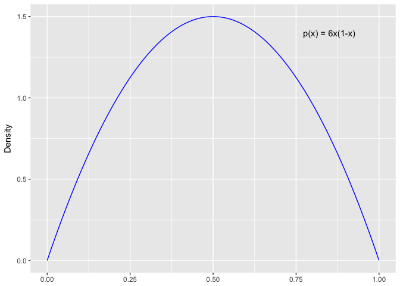
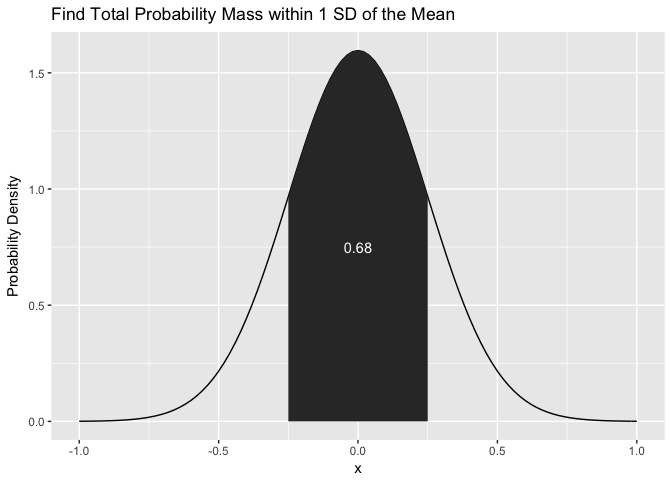

-   [Ch. 4 Problems: What is this stuff called
    probability?](#ch.-4-problems-what-is-this-stuff-called-probability)
    -   [Exercise 4.1 Concrete example of joint, marginal, conditional
        probabilities](#exercise-4.1-concrete-example-of-joint-marginal-conditional-probabilities)
    -   [Exercise 4.2 Random Number Generation in
        R](#exercise-4.2-random-number-generation-in-r)
    -   [Exercise 4.3 An example of the logic of long-run relative
        frequency](#exercise-4.3-an-example-of-the-logic-of-long-run-relative-frequency)
    -   [Exercise 4.4 Experience with a Probability Density Function in
        R and in
        calculus](#exercise-4.4-experience-with-a-probability-density-function-in-r-and-in-calculus)
    -   [Exercise 4.5 Use a Gaussian Distribution to describe degree of
        beliefs](#exercise-4.5-use-a-gaussian-distribution-to-describe-degree-of-beliefs)
    -   [Exercise 4.6 Recognize and work with the fact that Equation 4.9
        can be solved for the joint probability, crucial for developing
        Bayes'
        theorem.](#exercise-4.6-recognize-and-work-with-the-fact-that-equation-4.9-can-be-solved-for-the-joint-probability-crucial-for-developing-bayes-theorem.)

Ch. 4 Problems: What is this stuff called probability?
======================================================

### Exercise 4.1 Concrete example of joint, marginal, conditional probabilities

The eye-hair color data from Chapter 4 is a built in array in R, called
`HairEyeColor`. The following code explores the joint, marginal, and
conditional probabilities of these crosstabs.

First, the tables are broken into one for each sex, male and female. We
need to combine these into one table.

    # sum the cell frequencies in each table, forming a single table. 
    EyeHairFreq <- apply(HairEyeColor, c("Eye", "Hair"), sum)
    EyeHairFreq

           Hair
    Eye     Black Brown Red Blond
      Brown    68   119  26     7
      Blue     20    84  17    94
      Hazel    15    54  14    10
      Green     5    29  14    16

From this table of eye-hair counts, we might want to know the joint
probability of eye-hair combinations. A [Joint
probability](https://en.wikipedia.org/wiki/Joint_probability_distribution)
can be thought of as the probability of two events occurring at the
same.

The joint probabilities for every combination of eye and hair color sum
up to 1.

    # calculate the joint probability for each hair-eye color combination.
    EyeHairProp <- round(EyeHairFreq / sum(EyeHairFreq), 2)
    EyeHairProp

           Hair
    Eye     Black Brown  Red Blond
      Brown  0.11  0.20 0.04  0.01
      Blue   0.03  0.14 0.03  0.16
      Hazel  0.03  0.09 0.02  0.02
      Green  0.01  0.05 0.02  0.03

An example from above is finding what the joint probability of having
brown hair and blue eyes is? There is a 14% probability of this
combination of eye color and hair color out of all the different
combinations in the sample space.

Given we know the joint probabilities of eye and hair color combinations
in this sample space, we can now explore the [marginal
probability](https://en.wikipedia.org/wiki/Marginal_distribution), AKA
the unconditional probability. It describes the probability distribution
of the different outcomes of a single variable, unconditioned by any
other variable.

To get the marginal probability distribution of hair color, we sum the
counts down each column for each hair color, and just divide by the
total number of observations. We don't consider the eye color at all.

    # get the sum total marginal frequency of hair color, from the Male and Female table.  
    HairFreq <- apply(HairEyeColor, "Hair", sum) 
    # calculate the marginal probability of Hair Color
    HairProp <- round(HairFreq / sum(HairFreq), 2)
    HairProp

    Black Brown   Red Blond 
     0.18  0.48  0.12  0.21 

To get the marginal, or unconditioned, probability distribution of eye
color, we sum the counts across each row for each eye color, and divide
by the total records.

    EyeFreq <- apply(HairEyeColor, "Eye", sum) # sum the Eye columns, across both tables. 
    EyeProp <- round(EyeFreq / sum(EyeFreq), 2)
    EyeProp

    Brown  Blue Hazel Green 
     0.37  0.36  0.16  0.11 

Another probability we might like to know is the [conditional
probability](https://en.wikipedia.org/wiki/Conditional_probability).
Specifically, what's the probability of some event A, given that we know
another outcome of event B, is true. To calculate this, the equation is
*p*(*A*|*B*)=*p*(*A*, *B*)/*p*(*B*)

-   **p(A,B)** is the joint distribution of A and B both occurring.
-   **p(B)** is the marginal distribution of a particular outcome of
    event B.

So for example, if we want to know the conditional probability of all 4
hair colors, given that the person's eye color is blue, we need to take
the joint distribution of each hair color when the person has blue eyes,
and divide by the overall probability of having blue eyes.

    # conditional probability. p(hair color | blue eyes) = p(blue, hair color) / p(blue)
    round(EyeHairProp['Blue',] / EyeProp['Blue'], 2) 

    Black Brown   Red Blond 
     0.08  0.39  0.08  0.44 

### Exercise 4.2 Random Number Generation in R

Simulate a biased coin with a p(Heads) = 0.8. I will simulate this using
100,000 flips and plot the cumulative proportion of heads after each
flip. This exercise demonstrates, as eluded to by Kruschke that the
long-run relative frequency will approach and adequately approximate the
underlying true probability (we're assuming p(Heads) = 0.8 is true for
this particular coin). This is like the [law of large
numbers](https://en.wikipedia.org/wiki/Law_of_large_numbers).

We can simulate this using the `rbinom` function or the `sample`
function. I'll elect to use the former, as it's designed for
specifically sampling binomial (0,1) events. Then we can calculate and
plot the long-run relative frequency graphically.

    library(ggplot2)

    set.seed(123)
    biased_coin_sim <- rbinom(n = 100000, size = 1, prob = 0.8)

    # create dataframe to calculate cumulative heads, and the trial number.
    long_run_frequency <- data.frame(cumulative_heads = cumsum(biased_coin_sim),
                                     flip_number = seq_along(biased_coin_sim))

    log10_scale <- c(10, 100, 1000, 10000, 100000)
    ggplot(long_run_frequency, aes(x = flip_number, y = cumulative_heads / flip_number)) +
        geom_line() +
        geom_hline(yintercept = 0.8, linetype = "dotted") +
        scale_x_log10(breaks = log10_scale, labels = log10_scale) +
        labs(x = "Flip Number (log10 scaling)",
             y = "Proportion Heads",
             title = "Long Run Frequency of a biased Coin",
             subtitle = "p(Heads) = 0.8")

### Exercise 4.3 An example of the logic of long-run relative frequency

Determine the exact probability of drawing a 10 from a shuffled pinockle
deck (a pincokle deck has 48 cards with 6 values: 9, 10, Jack, Queen,
King, Ace). There are 2 copies of each value in the standard four suits:
hearts, diamonds, clubs, spades.

The pinockle deck has a joint frequency distribution across suits,
values as displayed:

    library(purrr)
    suit <- c("hearts", "diamonds", "clubs", "spades")
    number <- c("9", "10", "Jack", "Queen", "King", "Ace")

    pinockle_deck <- data.frame(suit = map(suit, rep, 12) %>%unlist(),
               number = rep(number, 8)) %>%
        table()

    pinockle_deck

              number
    suit       10 9 Ace Jack King Queen
      clubs     2 2   2    2    2     2
      diamonds  2 2   2    2    2     2
      hearts    2 2   2    2    2     2
      spades    2 2   2    2    2     2

What is the probability of getting a 10 from a random draw from a
pinockle deck?

    # find the joint probability distribution of each suit and number.
    pinockle_joint_prob <-round(pinockle_deck / sum(pinockle_deck), 3)
    pinockle_joint_prob

              number
    suit          10     9   Ace  Jack  King Queen
      clubs    0.042 0.042 0.042 0.042 0.042 0.042
      diamonds 0.042 0.042 0.042 0.042 0.042 0.042
      hearts   0.042 0.042 0.042 0.042 0.042 0.042
      spades   0.042 0.042 0.042 0.042 0.042 0.042

    # probability of getting a 10. Find the marginal probability of a 10 by summing the 10 column, unconditioned by the suit. 
    sum(pinockle_joint_prob[,"10"])

    [1] 0.168

What is the probability of getting a 10 or jack?

    # probability of getting a 10 or a jack. These are mutually exclusive card numbers (i.e. a 10 can't also be a jack), so we can just sum each of their marginal probabilities. 
    sum(pinockle_joint_prob[,c("10", "Jack")])

    [1] 0.336

### Exercise 4.4 Experience with a Probability Density Function in R and in calculus

\*\* NOTE: LATEX equations from Mathjax don't render on md\_document for
Github \*\*

Consider the probability density function *p*(*x*)=6*x*(1 − *x*)

As a reminder, a probability density is the ratio of probability mass to
the interval width. The probability density function can be expressed as
the intregral of
∫*d**x**p*(*x*)=1

**A)** Plot this density function and approximate its integral, only
considering values of x falling over the interval *x* ∈ \[0, 1\]

    pr_density <- function(x) {
        value <- (6 * x) * (1 - x)
        value
    }

    # while not infinitesimal, we'll consider each interval width in the range to be .001
    x_range <- seq(0, 1, by = .001) 

    # calculating the probability density for each interval between [0,1] 
    y_density <- pr_density(x_range)

    data.frame(x_range, y_density) %>%
        ggplot(aes(x = x_range, y = y_density)) +
            geom_line(color = "blue") +
            annotate("text", x = 0.85, y = 1.4, label = "p(x) = 6x(1-x)") +
            labs(x = NULL,
                 y = "Density")

**B)** Derive the exact integral using calculus.

∫01*d**x*6*x*(1 − *x*)

Apply the constant multiple rule for antiderivatives, and the power
rule.

6∫01*d**x*(*x* − *x*2)

Now we need to apply the power rule.

$$6( \\frac {x^2}{2} + \\frac {-x^3}{3} )$$

To integrate from 1 to 0, just find the difference between F(1) - F(0).
F(0) = 0. When we plug in 1 for F(1)

$$6( \\frac {1}{2} + \\frac {-1}{3} )$$

$$6( \\frac {1}{6} )=1$$

**C)** Yes, this function satisfies the definition of a probability
density function because it integrates to 1 over the interval ∈\[0, 1\].

**D)** From inspecting the graph, the maximum density is 1.5 density
when x is approximately 0.5. We can see this looks true when calculating
6(0.5)\*(1 − 0.5)=1.5

### Exercise 4.5 Use a Gaussian Distribution to describe degree of beliefs

**A)** Describe the area under a normal distribution, with mean mu = 0,
and standard deviation sigma = 0.25 by plotting and describing the
probability density between -1 and 1 standard deviations around the
mean.

    ggplot(data.frame(x = c(-1, 1)), aes(x)) +
        stat_function(fun = dnorm, args = list(mean = 0, sd = 0.25)) +
        stat_function(fun = dnorm,
                      xlim = c(-0.25,0.25),
                      geom = "area",
                      args = list(mean = 0, sd = 0.25)) +
        # get the total probability mass between -1 and + 1 sd.
        annotate("text", x = 0, y = 0.75, 
                 label = round(pnorm(0.25, 0, 0.25) - pnorm(-0.25, 0, 0.25), 2),
                 color = "white") +
        labs(y = "Probability Density",
             title = "Find Total Probability Mass within 1 SD of the Mean")

**B)** Now use normal curve to describe the following belief: you think
women's heights follow a bell-shaped distribution, centered at 162cm
with 2/3 of all heights falling between 147cm and 177cm. What should mu
and sigma be?

The mean should be 162. Since the distribution is described as normal,
and about 2/3 of all values fall between 147cm and 177cm, we can infer
that sigma is 162 - 147 = 15.

### Exercise 4.6 Recognize and work with the fact that Equation 4.9 can be solved for the joint probability, crucial for developing Bayes' theorem.

We are provided the marginal distribution of grade level from the survey
respondents. This is p(grade).

    # the provided marginal distribution of grade.
    grade_propn <- c(grade1 = .2, grade6 = .2, grade11 = .6)
    grade_propn

     grade1  grade6 grade11 
        0.2     0.2     0.6 

We're also provided the conditional probability of p(favorite\_food |
grade).

    # the provided conditional distribution of food preference given grade of respondent
    food_given_grade_propn <- matrix(c(0.3, 0.6, 0.1,
                                       0.6, 0.3, 0.1,
                                       0.3, 0.1, 0.6),
                                     byrow = TRUE,
                                     nrow = 3,
                                     ncol = 3,
                                     dimnames = list(grade = c("grade1", "grade6", "grade11"),
                                                     food = c("ice cream", "fruit", "fries")))
    food_given_grade_propn

             food
    grade     ice cream fruit fries
      grade1        0.3   0.6   0.1
      grade6        0.6   0.3   0.1
      grade11       0.3   0.1   0.6

Since we know the equation for a conditional probability of discrete
events is:

p(favorite\_food | grade) = p(favorite\_food, grade) / p(grade)

We have the two ingredients solve the joint distribution of
p(favorite\_food, grade) = p(favorite\_food | grade) \* p(grade). Note,
we just need to multiply both sides of the conditional probability
equation to now solve for the join probability, p(favorite\_food, grade)

    joint_probability_table <- grade_propn * food_given_grade_propn
    joint_probability_table

             food
    grade     ice cream fruit fries
      grade1       0.06  0.12  0.02
      grade6       0.12  0.06  0.02
      grade11      0.18  0.06  0.36

We confirm these are joint probabilities because the values in the above
table sum up to 1.0. Given the joint probabilities, can we say that food
preference is independent of grade?

If food preference is independent of grade level, or vice versa, we can
think about the conditional probability, p(favorite\_food | grade),
would be the same as p(favorite\_food) if grade has no influence.

Therefore under an assumption of independence, substitute
p(favorite\_food) for p(favorite\_food | grade) in the contitional
probability equation: p(favorite\_food) = p(favorite\_food, grade) /
p(grade).

This can be rearranged algebraically as p(favorite\_food) \* p(grade) =
p(favorite\_food, grade). If the marginal probability of a particular
food preference times the marginal probability of a particular grade
level equals the joint probability of that food preference and grade
level, then food preferences and grade level can be considered
independent events that don't influence each other.

One missing ingredient we didn't calculate yet is the marginal
probability of favorite food preferences overall in the sample.

    ice cream     fruit     fries 
         0.36      0.24      0.40 

Let's test independence by asking if liking fries is independent of
grade level. If it is, the joint probability of 1st graders liking
fries, for example, should be the same as p(fries) \* p(first grade).

The probability of being in 1st grade and liking fries is 0.02.

This does not equal the marginal probability of liking fries, 0.4 times
the marginal probability of being in 1st grade 0.2, which equals 0.08.
We can infer that food preference is dependent upon grade level.
