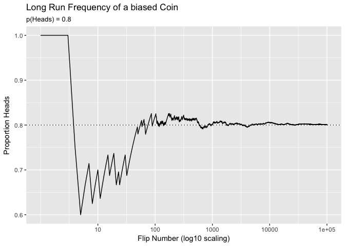

-   [Exercise 4.1 Concrete example of joint, marginal, conditional
    probabilities](#exercise-4.1-concrete-example-of-joint-marginal-conditional-probabilities)
-   [Exercise 4.2 Random Number Generation in
    R](#exercise-4.2-random-number-generation-in-r)
-   [Exercise 4.3 An example of the logic of long-run relative
    frequency](#exercise-4.3-an-example-of-the-logic-of-long-run-relative-frequency)
-   [Exercise 4.4 Experience with a Probability Density Function in R
    and in
    calculus](#exercise-4.4-experience-with-a-probability-density-function-in-r-and-in-calculus)
-   [Exercise 4.5 Using a Gaussian Distribution to describe degree of
    beliefs](#exercise-4.5-using-a-gaussian-distribution-to-describe-degree-of-beliefs)
-   [Exercise 4.6 Recognize and work with the fact that Equation 4.9 can
    be solved for the joint probability, crucial for developing Bayes'
    theorem.](#exercise-4.6-recognize-and-work-with-the-fact-that-equation-4.9-can-be-solved-for-the-joint-probability-crucial-for-developing-bayes-theorem.)

### Exercise 4.1 Concrete example of joint, marginal, conditional probabilities

The eye-hair color data from Chapter 4 is a built in array in R, called
`HairEyeColor`. The following code explores the joint, marginal, and
conditional probabilities of these crosstabs. First, the tables are
broken into one for each sex, male and female. We need to combine these
into a single crosstab. The apply() function in R lets us perform
functions, like a summation, across elements of a table.

    # sum the cell frequencies in each table, forming a single table. 
    EyeHairFreq <- apply(HairEyeColor, c("Eye", "Hair"), sum)
    EyeHairFreq

           Hair
    Eye     Black Brown Red Blond
      Brown    68   119  26     7
      Blue     20    84  17    94
      Hazel    15    54  14    10
      Green     5    29  14    16

From this table of eye-hair counts, we might want to know the joint
probability of eye-hair combinations. A [Joint
probability](https://en.wikipedia.org/wiki/Joint_probability_distribution)
can be thought of as the probability of two events occurring at the
same.

The joint probabilities for every combination of eye and hair color sum
up to 1.

    # calculate the joint probability for each hair-eye color combination.
    EyeHairProp <- round(EyeHairFreq / sum(EyeHairFreq), 2)
    EyeHairProp

           Hair
    Eye     Black Brown  Red Blond
      Brown  0.11  0.20 0.04  0.01
      Blue   0.03  0.14 0.03  0.16
      Hazel  0.03  0.09 0.02  0.02
      Green  0.01  0.05 0.02  0.03

Given we know the joint probabilities of eye and hair color combinations
in this sample, we can now explore the [marginal
probability](https://en.wikipedia.org/wiki/Marginal_distribution). The
marginal probability is found when we sum the probabilities across the
rows or the columns in the table, unconditioned by the other variable.
In other words its describing the probability distribution of the
different outcomes of that variable.

To get the marginal, or unconditioned, probability distribution of hair
color, we sum the counts down each column for each hair color, and
divide by the total number of records in the sample.

    # get the sum total marginal frequency of hair color, from the Male and Female table.  
    HairFreq <- apply(HairEyeColor, "Hair", sum) 
    # calculate the marginal probability of Hair Color
    HairProp <- round(HairFreq / sum(HairFreq), 2)
    HairProp

    Black Brown   Red Blond 
     0.18  0.48  0.12  0.21 

To get the marginal, or unconditioned, probability distribution of eye
color, we sum the counts across each row for each eye color, and divide
by the total records.

    EyeFreq <- apply(HairEyeColor, "Eye", sum) # sum the Eye columns, across both tables. 
    EyeProp <- round(EyeFreq / sum(EyeFreq), 2)
    EyeProp

    Brown  Blue Hazel Green 
     0.37  0.36  0.16  0.11 

Another probability we might like to know is the [conditional
probability](https://en.wikipedia.org/wiki/Conditional_probability).
Specifically, what's the probability of some event A, given that we know
another outcome of event B, is true. To calculate this, the equation is:
p(A | B) = p(A,B) / p(B).

p(B) is the marginal distribution of a particular outcome of event B.
p(A,B) is the joint distribution of A and B both occurring.

So for example, if we want to know the conditional probability of all 4
hair colors, given that the person's eye color is blue, we need to take
the joint distribution of each hair color when its blue eyes, and divide
by the overall probability of having blue eyes.

    # conditional probability. p(hair color | blue eyes) = p(blue, hair color) / p(blue)
    round(EyeHairProp['Blue',] / EyeProp['Blue'], 2) 

    Black Brown   Red Blond 
     0.08  0.39  0.08  0.44 

### Exercise 4.2 Random Number Generation in R

Simulate a biased coin with a p(Heads) = 0.8. I will simulate this using
100,000 flips and plot the cumulative proportion of heads after each
flip. This exercise demonstrates, as eluded to by Kruschke that the
long-run relative frequency will approach and adequately approximate the
underlying true probability (we're assuming p(Heads) = 0.8 is true for
this particular coin). This is like the [law of large
numbers](https://en.wikipedia.org/wiki/Law_of_large_numbers).

We can simulate this using the `rbinom` function or the `sample`
function. I'll elect to use the former, as it's designed for
specifically sampling binomial (0,1) events. Then we can calculate and
plot the long-run relative frequency graphically.

    library(ggplot2)

    set.seed(123)
    biased_coin_sim <- rbinom(n = 100000, size = 1, prob = 0.8)

    # create dataframe to calculate cumulative heads, and the trial number.
    long_run_frequency <- data.frame(cumulative_heads = cumsum(biased_coin_sim),
                                     flip_number = seq_along(biased_coin_sim))

    log10_scale <- c(10, 100, 1000, 10000, 100000)
    ggplot(long_run_frequency, aes(x = flip_number, y = cumulative_heads / flip_number)) +
        geom_line() +
        geom_hline(yintercept = 0.8, linetype = "dotted") +
        scale_x_log10(breaks = log10_scale, labels = log10_scale) +
        labs(x = "Flip Number (log10 scaling)",
             y = "Proportion Heads",
             title = "Long Run Frequency of a biased Coin",
             subtitle = "p(Heads) = 0.8")

### Exercise 4.3 An example of the logic of long-run relative frequency

### Exercise 4.4 Experience with a Probability Density Function in R and in calculus

### Exercise 4.5 Using a Gaussian Distribution to describe degree of beliefs

### Exercise 4.6 Recognize and work with the fact that Equation 4.9 can be solved for the joint probability, crucial for developing Bayes' theorem.
