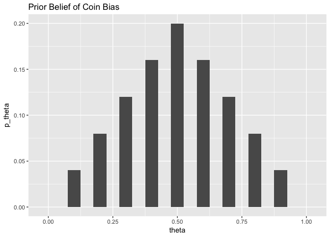
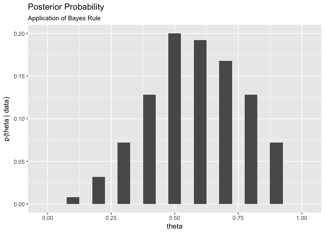
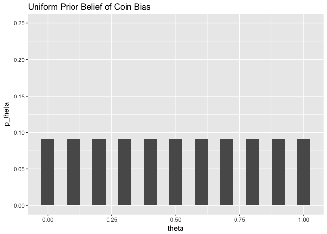
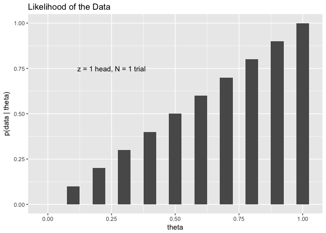
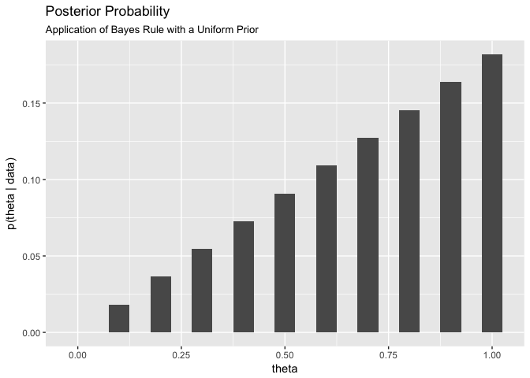
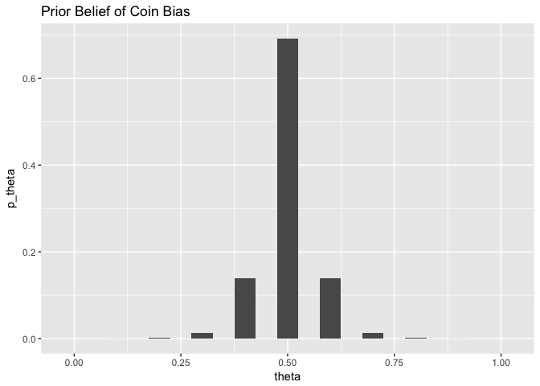
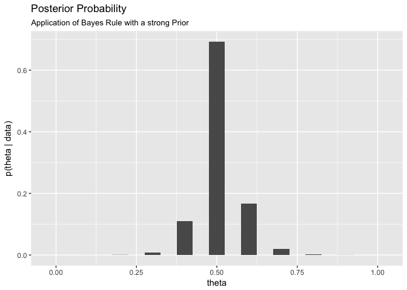
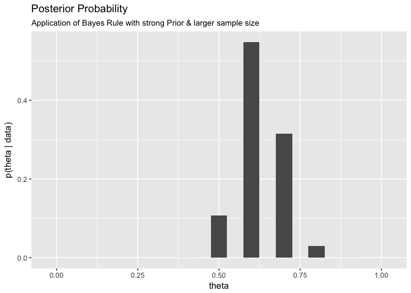

Ch 5 Problems: Bayes Rule
================
Brandon Hoeft
February 4, 2018

-   [Exercise 5.1 Application of Bayes Rule and seeing how Posterior Probabilities change with inclusion of more data](#exercise-5.1-application-of-bayes-rule-and-seeing-how-posterior-probabilities-change-with-inclusion-of-more-data)
-   [Exercise 5.2 Getting Intuition for Previous Results by using Natural Frequency and Markov Representations.](#exercise-5.2-getting-intuition-for-previous-results-by-using-natural-frequency-and-markov-representations.)
-   [Exercise 5.3 Data Order Invariance](#exercise-5.3-data-order-invariance)
-   [5.4 Visual intuition into Bayesian Updating (centered prior, single observation)](#visual-intuition-into-bayesian-updating-centered-prior-single-observation)
-   [5.4 Visual intuition into Bayesian Updating (uniform prior, single observation)](#visual-intuition-into-bayesian-updating-uniform-prior-single-observation)
-   [5.4 Visual intuition into Bayesian Updating (strong prior, single observation)](#visual-intuition-into-bayesian-updating-strong-prior-single-observation)
-   [5.4 Visual intuition into Bayesian Updating (strong prior and larger sample)](#visual-intuition-into-bayesian-updating-strong-prior-and-larger-sample)

Exercise 5.1 Application of Bayes Rule and seeing how Posterior Probabilities change with inclusion of more data
----------------------------------------------------------------------------------------------------------------

After analysis of table 5.4 from the book, our posterior belief that the randomly tested person has the disease, given they tested positive is p(theta = disease | test = +) = 0.019.

Upon retest for the disease (test \#2), this same randomly selected person tests negative. What should we believe now about their probability of having the rare disease?

p(disease | test2 = -) = (p(test = - | disease) x p(disease)) / p(test = -)

We know generally that p(test = - | disease) = 0.01, a small likelihood. This is the false negative rate.

P(disease) = 0.019, the posterior probability of our first test result, but now serving as our updated prior probability of having the disease for this random patient..

P(test = -) represents the marginal or unconditional probability of having a negative test result, which considers the event space in which you could have a negative result. You could have a negative result with the disease (false negative) or negative result and not have the disease (true negative). P(test = -) = 0.949069. Again, this is the denominator of Bayes rule, and it normalizes the observed new data and prior information by the unconditioned probability in which the subject could end up with a negative test result.

As a result, we get p(disease | test2 = -) = (0.01 x 0.019) / 0.949069. The probability of having the disease given that the 2nd test returned negative = 0.0002002.

Exercise 5.2 Getting Intuition for Previous Results by using Natural Frequency and Markov Representations.
----------------------------------------------------------------------------------------------------------

1.  Suppose the population consists of 100,000 people. Compute how many people would be expected to fall into each cell from table 5.4, joint and marginal probabilities of test results vs. disease states.

``` r
matrix_labels <- list(test = c("test pos", "test neg"),
                      disease = c("true", "false"))

joint_probability <- matrix(c(.00099, .001 - .00099,.04995, .999 - .04995), 
                            nrow = 2, ncol = 2, 
                            dimnames = matrix_labels)
joint_probability
```

              disease
    test          true   false
      test pos 0.00099 0.04995
      test neg 0.00001 0.94905

``` r
test_results_disease_state_freq <- matrix(c(100000 *joint_probability), 
                                          nrow = 2, ncol = 2,
                                          dimnames = matrix_labels)
test_results_disease_state_freq
```

              disease
    test       true false
      test pos   99  4995
      test neg    1 94905

1.  From the cell frequencies alone, determine the proportion of people who have the disease, given their test result is positive.

``` r
test_results_disease_state_freq[1] / sum(test_results_disease_state_freq[1, ])
```

    [1] 0.01943463

1.  Now start with a population of 10,000,000 people. Of the 10,000 expected to have the disease 9,900 will be expected to test positive. Of the 9,990,000 expected to not have the disease, 499,500 are expected to test positive (5% false positive rate).

Consider retesting everyone who has tested positive on the first test. How many are expected to show a negative result on the retest?

``` r
# people expected have disease who test positive, times p(test = - | have disease)
test2_neg_and_have_disease <- 9900 * (joint_probability[2] / sum(joint_probability[, 1]))
# people expected not have disease who test positive, times p(test = - | don't have disease)
test2_neg_and_no_disease <- 499500 * (joint_probability[4] / sum(joint_probability[, 2]))

test2_neg_and_have_disease + test2_neg_and_no_disease
```

    [1] 474624

1.  What proportion of people who test positive at first and then negative on the retest, actually have the disease? This matches the same result from exercise 5.1.

``` r
test2_neg_and_have_disease / sum(test2_neg_and_have_disease, test2_neg_and_no_disease)
```

    [1] 0.0002085862

Exercise 5.3 Data Order Invariance
----------------------------------

Consider the same diagnostic and disease scenarios. Suppose a person is selected at random, takes the test, it comes back negative. What's the probability the person has the disease?

p(disease | test = -) = (p(test = - | disease) x p(disease)) / p(test = -)

``` r
joint_probability
```

              disease
    test          true   false
      test pos 0.00099 0.04995
      test neg 0.00001 0.94905

``` r
likelihood <- joint_probability[2] / sum(joint_probability[,1])
prior <- .001
prob_of_having_neg_test <- (likelihood * prior) + ((joint_probability[4] / sum(joint_probability[, 2])) * (1-prior)) 

(likelihood * prior) / prob_of_having_neg_test
```

    [1] 0.00001053674

The person gets retested, and on test 2 the result is positive. What's the probability the person has the disease? Remember, we have new information from the first test, so our prior needs to be updated.

p(disease | test2 = +) = (p(test = + | disease) x p(disease updated)) / p(test = +)

``` r
# new question: do they have the disease since the 2nd test came back positive?
prior <- (likelihood * prior) / prob_of_having_neg_test
# p(test = + | have disease)
likelihood <- joint_probability[1] / sum(joint_probability[,1])
prob_of_having_pos_test <- (likelihood * prior) + ((joint_probability[3] / sum(joint_probability[, 2])) * (1 - prior))

(likelihood * prior) / prob_of_having_pos_test
```

    [1] 0.0002085862

**Notice that we get about the same final probability of having the disease here as we did in 5.1 and 5.2D, even though the order switched in which the randomly tested person got a positive result and a negative result.** This is because of *data order invariance*: data probabilities are treated as independent observations so the order in which we update posteriors with new observations has no impact on the final posterior probability.

5.4 Visual intuition into Bayesian Updating (centered prior, single observation)
--------------------------------------------------------------------------------

Recreate Example from Figure 5.1. We are trying to assess the bias of a coin. To keep it simple, we think there are 11 discrete possible values of the coin's bias (i.e. it's true likelihood of coming up heads). The possible parameter (theta) values of the coin's bias are

``` r
theta <- seq(0, 1, by = 0.1) # possible values of the coin's bias
theta
```

     [1] 0.0 0.1 0.2 0.3 0.4 0.5 0.6 0.7 0.8 0.9 1.0

Regarding these possible biases, we can assign a prior belief about how likely we think it is that the coin manfuacturer is to create each type of biased coin. Here's we'll assume a prior belief centered around a fair coin.

``` r
# Our personal beliefs about the probability of the coin's bias.
p_theta <- pmin(theta, 1 - theta) # triangular shaped prior.
p_theta <- p_theta / sum(p_theta) # make it a probability mass function
```



Now we'll collect some data. Say we just make 1 flip of the coin (N) and get 1 heads (z = 1). Plug these data into the likelihood function for a bernoulli event. **To elaborate, the likelihood function is the probability that the data could be generated by a model with parameter value, theta **. What's the Bernoulli likelihood function, p(data | theta)? We see that given our possible parameters of coin bias, for 1 flip, 1 heads observed data, the likelihood is highest at theta = 1.0 and lowest at 0.

``` r
observed_data <- 1 # observe 1 flip turn up heads
z <- sum(observed_data) # number of flips turning up 1.
N <- length(observed_data) # number of trials.
# calculate p(data | theta) using a bernoulli likelihood function. 
bernoulli_likelihood <- (theta ** z) * (1 - theta) ** (N - z)
```


The posterior distribution, is our updated beliefs about the bias of the coin after 1 flip that was a heads, updating from our prior belief of the coin's bias.

``` r
# the marginal likelihood of the data, or overall "evidence" of getting a heads under all different scenarios of parameter = theta.
p_data <- sum(p_theta * bernoulli_likelihood)
# p(theta | data) = P(data | theta) * p(theta) / p(data) 
posterior <- (bernoulli_likelihood * p_theta) / p_data
```

 As a result of our initial beliefs about coin bias, then observing some data (1 heads from 1 trial), mathematically, we update our beliefs (reallocate credibility) slightly from the single datum. The coin is slightly more likely to be biased towards heads above 0.5.

5.4 Visual intuition into Bayesian Updating (uniform prior, single observation)
-------------------------------------------------------------------------------

What if we have no prior beliefs about the coin bias? We could represent beliefs of possible values of theta with a uniform distribution. Assume the same simple discrete possibilities of theta from before.

``` r
# Our personal beliefs about the probability of the coin's bias.
p_theta <- rep(1/ length(theta), length(theta)) # uniform shaped prior.
data.frame(theta = theta,
           p_theta = p_theta) %>%
    ggplot(aes(x = theta, y = p_theta)) + 
        geom_bar(stat = "identity", width = 0.05) +
    labs(title = "Uniform Prior Belief of Coin Bias") +
    scale_y_continuous(limits = c(0,0.25))
```



We'll assume the same data collection as before. 1 flip of the coin (N) and get 1 heads (z = 1). What's the p(data | theta)? We see that given our possible parameters of coin bias, for 1 flip, 1 heads observed data, the likelihood is highest at theta = 1.0 and lowest at 0.



The posterior distribution, is our updated beliefs about the bias of the coin after 1 flip that was a heads, updating from our **uniform prior belief** of the coin's bias.

``` r
# the marginal likelihood of the data, or overall "evidence" of getting a heads under all different scenarios of parameter = theta.
p_data <- sum(p_theta * bernoulli_likelihood)
# p(theta | data) = P(data | theta) * p(theta) / p(data) 
posterior <- (bernoulli_likelihood * p_theta) / p_data
```



The posterior distribution is shaped exactly like the likelihood function when we use a uniform prior belief! As a result of our initial uniform beliefs about coin bias, meaning we thought all of the different options of theta were equally valid, observing some data (1 heads from 1 trial), we reallocate credibility to indicate that it's most likely that the coin has bias of 1.0 towards heads, b/c we observed only 1 heads in 1 chance.

5.4 Visual intuition into Bayesian Updating (strong prior, single observation)
------------------------------------------------------------------------------

What if we have very strong prior belief about the coin bias? Let's say we believe it's very likely to be a fair coin, with almost no bias, so theta is strongly centerered around 0.5. Assume the same simple discrete possibilities of theta from before.

``` r
# Our personal beliefs about the probability of the coin's bias.
p_theta <- c(0, 0.0001, 0.001, 0.01, 0.1, 0.5, 0.1, 0.01, 0.001, 0.0001, 0) # triangular shaped prior.
p_theta <- p_theta / sum(p_theta) # make it a probability mass function
```



We'll assume the same data collection as before. 1 flip of the coin (N) and get 1 heads (z = 1). What's the Bernoulli likelihood function, p(data | theta)?


The posterior distribution, is our updated beliefs about the bias of the coin after 1 flip that was a heads, updating now from our more strongly opinionated prior of the coin's bias being close to theta = 0.5, or unbiased.

``` r
# the marginal likelihood of the data, or overall "evidence" of getting a heads under all different scenarios of parameter = theta.
p_data <- sum(p_theta * bernoulli_likelihood)
# p(theta | data) = P(data | theta) * p(theta) / p(data) 
posterior <- (bernoulli_likelihood * p_theta) / p_data
```



With a strong prior, and only a single datum, now the posterior distribution is shaped almost like the prior belief! This makes intuitive sense. If we have strong prior beliefs, we won't reallocate credibility significantly b/c we observed only 1 heads in 1 chance. We need a lot more Bernoulli trials showing evidence of strong negative or positive bias to move the posterior distribution left or right here.

\*\* One thing we have not covered yet though is how data can influence the posterior. A single datum won't influence the posterior as much as a larger sample size. The larger the sample size, the more likely that the posterior distribution will be shaped similarly to the likelihood distribution than the prior distribution. let's try an example.

5.4 Visual intuition into Bayesian Updating (strong prior and larger sample)
----------------------------------------------------------------------------

Keeping with our strong prior belief from just before, but now, let's say we have N = 40 trials, with z = 30 heads observed. What are our posterior beliefs about coin bias?


The likelihood function needs to be updated to account for N = 40 trials, and z = 30 heads. Before examples all used 1 trial returning a heads. **To revisit, the likelihood function is the probability that the data could be generated by a model with a given parameter value, theta **. What's the p(data | theta)?

``` r
set.seed(1)
# sample 40 coin flip trials where we observe ~ 75% heads
observed_data <- sample (x = c(0,1), size = 40, prob = c(0.25, 0.75), replace = TRUE)
# observe 1 flip turn up heads
z <- sum(observed_data) # number of flips turning up 1.
N <- length(observed_data) # number of trials.
# calculate p(data | theta) using a bernoulli likelihood function. 
bernoulli_likelihood <- (theta ** z) * (1 - theta) ** (N - z)
```


We can measure the posterior distribution about the bias of the coin after a larger sample of 40 flips yielding 75% heads, while also considering our strongly opinionated prior of the coin's unbiased nature at around theta = 0.5.

``` r
# the marginal likelihood of the data, or overall "evidence" of getting a heads under all different scenarios of parameter = theta.
p_data <- sum(p_theta * bernoulli_likelihood)
# p(theta | data) = P(data | theta) * p(theta) / p(data) 
posterior <- (bernoulli_likelihood * p_theta) / p_data
```



When given a larger sample of observations, we see that the mode of the posterior is still between the mode of the likelihood and the mode of our prior beliefs. **The Takeaway: With more real data pointing towards a heads biased coin, the posterior distribution will continue to look more and more like the likelihood function.**
