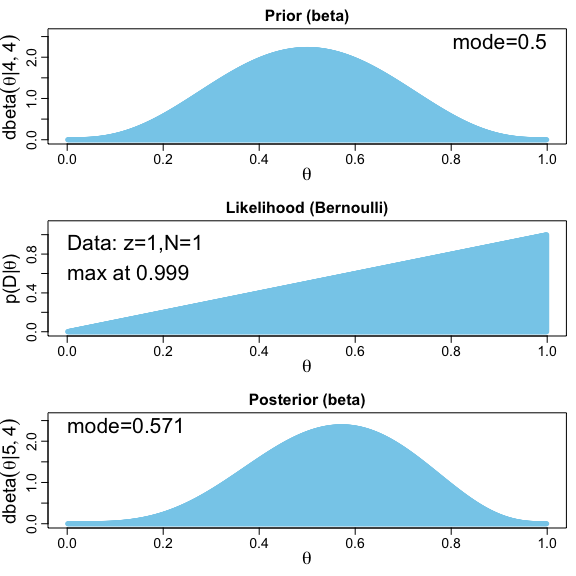
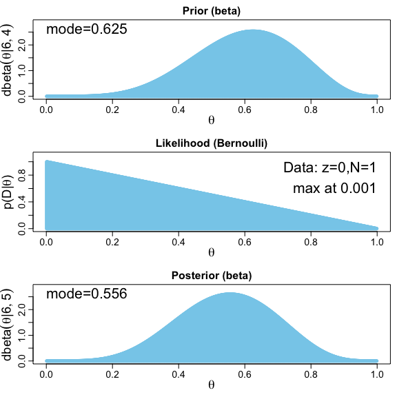
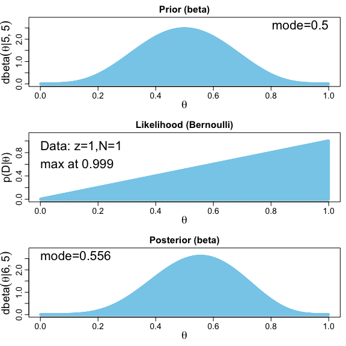
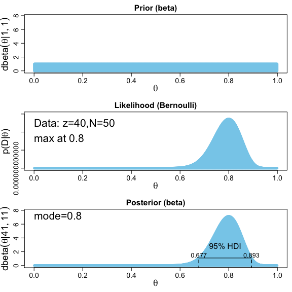

Ch 6 Problems: Infer Binomial Probability via Exact Mathematical Analysis
================
Brandon Hoeft
February 11, 2018

-   [Exercise 6.1](#exercise-6.1)
    -   [6.1A A single coin flip](#a-a-single-coin-flip)
    -   [Side Note: Calculate Beta Distribution with Base R](#side-note-calculate-beta-distribution-with-base-r)
    -   [6.1B Use posterior from the last flip as the new prior](#b-use-posterior-from-the-last-flip-as-the-new-prior)
    -   [6.1C Observe a tails on the 3rd flip.](#c-observe-a-tails-on-the-3rd-flip.)
    -   [6.1D Change the order of the observed data](#d-change-the-order-of-the-observed-data)
-   [Exercise 6.2 Election Polling](#exercise-6.2-election-polling)
    -   [6.2A Read about some polling data](#a-read-about-some-polling-data)
    -   [6.2B Incorporate your own personal polling data](#b-incorporate-your-own-personal-polling-data)
-   [Exercise 6.3 Learning Experiment Biases](#exercise-6.3-learning-experiment-biases)
-   [Exercise 6.4](#exercise-6.4)
-   [Exercise 6.5](#exercise-6.5)

Exercise 6.1
------------

This another exercise (similar to Ch. 5) to show that the posterior distribution from successive coin flips is invariant to the ordering of the data observed.

### 6.1A A single coin flip

Start with a prior that expresses some uncertainty that a coin is fair: B(*θ* | 4, 4). This beta distribution expresses a prior of a = 4 heads, b = 4 tails. You flip the coin once, returning heads. **what's the posterior distribution**?

A beta posterior distribution is of the form **B(*θ* | z + a, N - z + b)** where:

-   z: number of observed heads from the data
-   N: total number of trials from the data
-   a: shape parameter 1 of beta distribution (i.e. successes)
-   b: shape parameter 2 of beta distribution (i.e. failures)

Using the `BernBeta` function associated with programs from the book, we get:

``` r
source("/Users/bhoeft/Desktop/temp/DBDA Programs/DBDA2E-utilities.R")
```


    *********************************************************************
    Kruschke, J. K. (2015). Doing Bayesian Data Analysis, Second Edition:
    A Tutorial with R, JAGS, and Stan. Academic Press / Elsevier.
    *********************************************************************

``` r
source("/Users/bhoeft/Desktop/temp/DBDA Programs/BernBeta.R")
# a = 4, b = 4 for beta prior; observe 1 head from 1 flip. 
BernBeta(priorBetaAB = c(4, 4), Data = c(1), showCentTend="Mode")
```



    [1] 5 4

We see that the posterior distribution is of the form **B(*θ* | 5, 4)**. Since we observed only 1 head, the posterior distribution only shifts a little to the right. The Posterior is a compromise between our prior beliefs and a single data point observed.

### Side Note: Calculate Beta Distribution with Base R

Our theta, beta prior, and beta posterior could all be derived using base R function `dbeta`.

``` r
# create a sequence of possible values of parameter theta, our prior beliefs. 
theta <-  seq(0, 1, by = 0.1),
# calculate a PDF of our prior beliefs using the beta distribution. 
beta_prior <- dbeta(theta, shape1 = 4, shape2 = 4),
# Posterior distribution B(theta | z + a, N - z + b)
beta_posterior <- dbeta(theta, shape1 = 4 + 1, shape2 = 1 - 1 + 4)
```

### 6.1B Use posterior from the last flip as the new prior

Here a = 5, and b = 4 as our beta distribution shape parameters. They account for the 1 heads in 1 trial observed in the prior experiment. On this next flip, we also get a head. What's our new posterior distribution?

``` r
# a = 5, b = 4 for beta prior; 1 for observing 1 heads
BernBeta(priorBetaAB = c(5, 4), Data = c(1), showCentTend="Mode")
```


    [1] 6 4

We see that the posterior distribution is of the form **B(*θ* | 6, 4)**.

### 6.1C Observe a tails on the 3rd flip.

Using the posterior from the last flip (accounts for 2 heads in 2 flips per the data), make a third coin flip, which returned tails. Now, what is the new posterior?

``` r
# a = 6, b = 4 for beta prior; 1 for observing 1 heads
BernBeta(priorBetaAB = c(6, 4), Data = c(0), showCentTend="Mode")
```



    [1] 6 5

We see that the posterior distribution is of the form **B(*θ* | 6, 5)**.

### 6.1D Change the order of the observed data

If you changed the order of the observed flips from **Head**, **Head**, **Tail** to **Tail**, **Head**, **Head** instead, would we get the same posterior distribution as observed in **6.1C**? Yes, because this analysis assumes each observation is treated as an independent event.

``` r
# Data observed previously is T, H. So B(theta | 1 + 4, 2 - 1 + 4) -> B(theta | 5, 5) is new prior
# toss a Head on final toss
BernBeta(priorBetaAB = c(5, 5), Data = c(1), showCentTend="Mode")
```



    [1] 6 5

We get the same final posterior form as before regardless of ordering of the 3 coin tosses. The posterior distribution is of the identical form **B(*θ* | 6, 5)** from **6.1C**.

Exercise 6.2 Election Polling
-----------------------------

To connect high-density intervals to the real world. Suppose an election is coming up for Candidate A vs. B. *A recently published newspaper poll says that of 100 randomly sampled people, 58 preferred candidate A*.

### 6.2A Read about some polling data

Suppose prior to reading the poll, your belief about who would win was **uniform**. What's your 95% HDI of your beliefs now having read the poll? A uniform beta distribution is of the form **B(*θ* | 1, 1)**

``` r
prior_beliefs <- c(1, 1) # shape a and b parameters.
polling_observations <- c(rep(1, 58), rep(0, 100-58))
BernBeta(priorBetaAB = prior_beliefs,
         Data = polling_observations,
         showHDI = TRUE,
         showCentTend = "Mode")
```


    [1] 59 43

### 6.2B Incorporate your own personal polling data

Say you conduct a follow up poll from the one you read about, and 57 of 100 people randomly sampled prefer candidate A. Now, what is the 95% highest density interval of your posterior beliefs that the general population prefers candidate A to B?

``` r
updated_prior_beliefs <- prior_beliefs + c(58, 100-58) # updated prior shape a and b parameters.
polling_observations2 <- c(rep(1, 57), rep(0, 100-57)) # my personal poll

BernBeta(priorBetaAB = updated_prior_beliefs,
         Data = polling_observations2,
         showHDI = TRUE,
         showCentTend = "Mode")
```


    [1] 116  86

Given more data that resembles our updated previous beliefs, the posterior 95% HDI starts to get more concentrated or centered around *θ* = 0.58.

Exercise 6.3 Learning Experiment Biases
---------------------------------------

People have been thoroughly trained in a simple learning experiment:

-   when they see two words, "radio" and "ocean", press F on keyboard
-   when they see the two words, "radio" and "mountain", press J on the keyboard

New experiment with 50 people:

-   when they see word "radio", instruct them to press F or J. 40 chose F, 10 chose J.
-   when they see the words "ocean" and "mountain", press F or J. 15 chose F, 35 chose J.

Assuming a **uniform prior** belief, are people biased toward F or J for either of these test types? Use a 95% HDI to determine which biases can be claimed credible.

``` r
prior_beliefs <- c(1, 1) # beta distribution shape a and b parameters
radio_experiment <- c(rep(1, 40), rep(0, 10)) # Response F is 1, response J is 0.
BernBeta(priorBetaAB = prior_beliefs,
         Data = radio_experiment,
         showHDI = TRUE,
         showCentTend = "Mode")
```



    [1] 41 11

When we assess the computer keys pressed after hearing the word "radio", the 95% HDI of the posterior distribution starts goes from 0.68 to 0.89, way beyond *θ* = 0.5, which is the **region of practical equivalence (ROPE)** where we'd expect the bias towards F or J to be covered if people were truly not biased towards pressing either F or J key. We conclude that people have a bias towards F when they hear the word "radio" in this experiment.

``` r
prior_beliefs <- c(1, 1) # beta distribution shape a and b parameters
radio_experiment <- c(rep(1, 15), rep(0, 35)) # Response F is 1, response J is 0.
BernBeta(priorBetaAB = prior_beliefs,
         Data = radio_experiment,
         showHDI = TRUE,
         showCentTend = "Mode")
```


    [1] 16 36

When we assess the computer keys pressed after hearing the word "ocean" and "mountain", the 95% HDI of the posterior distribution does not cover *θ* = 0.5. We can conclude that the participants have a bias against choosing F when hearing these two words together.

Exercise 6.4
------------

Exercise 6.5
------------
