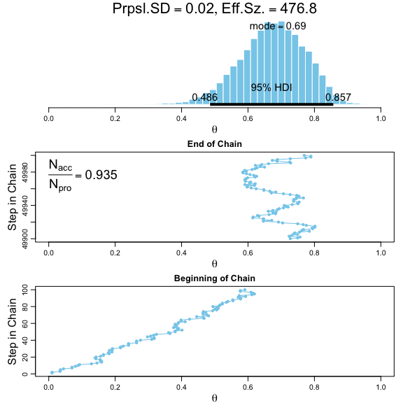
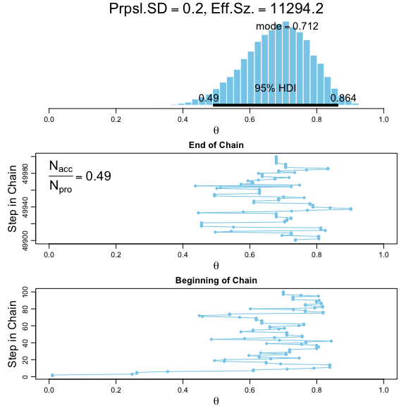

Chapter 7 Problems: Markov Chain Monte Carlo
================
Brandon Hoeft
April 8, 2018

-   [Exercise 7.1 Experiment with Metropolis Algorithm](#exercise-7.1-experiment-with-metropolis-algorithm)
    -   [Metropolis Algorithm (MCMC) with Proposal SD of 0.02](#metropolis-algorithm-mcmc-with-proposal-sd-of-0.02)
    -   [Metropolis Algorithm (MCMC) with Proposal SD of 0.2](#metropolis-algorithm-mcmc-with-proposal-sd-of-0.2)
    -   [Metropolis Algorithm (MCMC) with Proposal SD of 2.0](#metropolis-algorithm-mcmc-with-proposal-sd-of-2.0)

Exercise 7.1 Experiment with Metropolis Algorithm
-------------------------------------------------

The script called `BernMetrop.R` from the program files for the book implements a Metrolopis Algorithm. Run the algorithm three times, each using different standard deviation of the **proposal distribution**.

The **proposal distribution** enables Metropolis algorithm to take a random walk through the parameter space of *θ*, effectively drawing samples from its posterior distribution . The SD of the **proposal distribution** we draw random samples from impacts how slowly or quickly the algorithm may explore the posterior distribution of *θ*.

Here we'll explore the impact of 3 different values of proposal distribution SD from a standardized normal distribution: 0.02, 0.2, 2.0.

### Metropolis Algorithm (MCMC) with Proposal SD of 0.02

First is using a proposal distribution SD of 0.02. We see the histogram of the posterior distribution followed by plots of the beginning and ending of the MCMC sampling chain.

``` r
# added line 5 in script below. commented out line 1, 4, 57. comment out line 89 for openGraph so can generate the graph output in this RMarkdown script. Change seed in line 55 to 123. 
source("/Users/bhoeft/Desktop/temp/DBDA Programs/BernMetrop_7_1_sd1.R")
```


    *********************************************************************
    Kruschke, J. K. (2015). Doing Bayesian Data Analysis, Second Edition:
    A Tutorial with R, JAGS, and Stan. Academic Press / Elsevier.
    *********************************************************************



### Metropolis Algorithm (MCMC) with Proposal SD of 0.2

``` r
# added line 5 in script below. commented out line 1, 4, 57. comment out line 89 for openGraph so can generate the graph output in this RMarkdown script. Change seed in line 55 to 123. 
source("/Users/bhoeft/Desktop/temp/DBDA Programs/BernMetrop_7_1_sd2.R")
```


    *********************************************************************
    Kruschke, J. K. (2015). Doing Bayesian Data Analysis, Second Edition:
    A Tutorial with R, JAGS, and Stan. Academic Press / Elsevier.
    *********************************************************************



### Metropolis Algorithm (MCMC) with Proposal SD of 2.0

``` r
# added line 5 in script below. commented out line 1, 4, 57. comment out line 89 for openGraph so can generate the graph output in this RMarkdown script. Change seed in line 55 to 123. 
source("/Users/bhoeft/Desktop/temp/DBDA Programs/BernMetrop_7_1_sd3.R")
```


    *********************************************************************
    Kruschke, J. K. (2015). Doing Bayesian Data Analysis, Second Edition:
    A Tutorial with R, JAGS, and Stan. Academic Press / Elsevier.
    *********************************************************************


