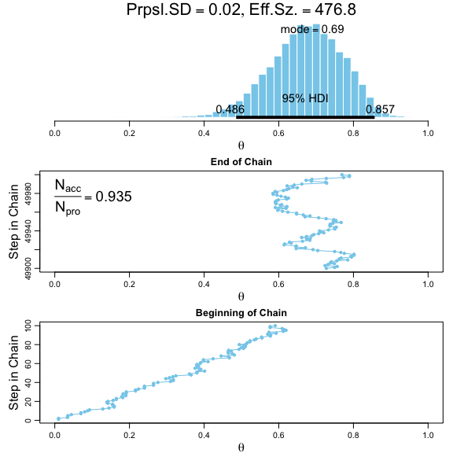
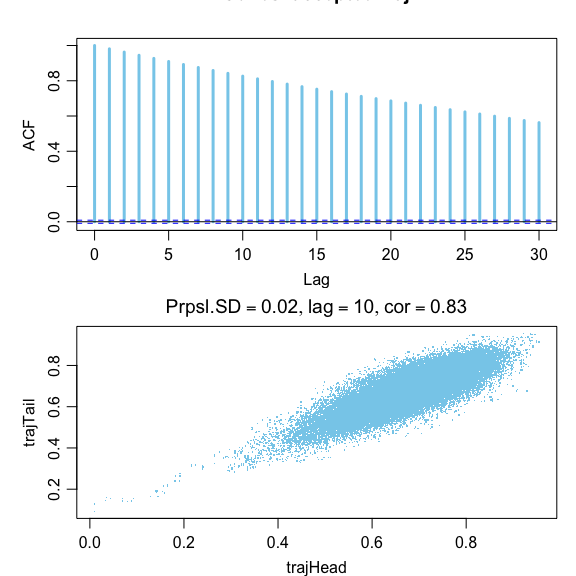
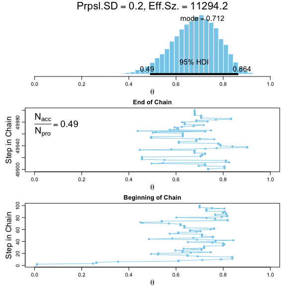
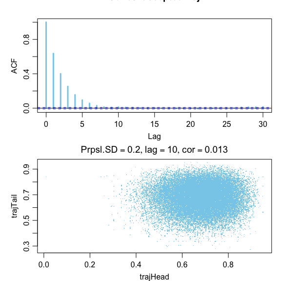
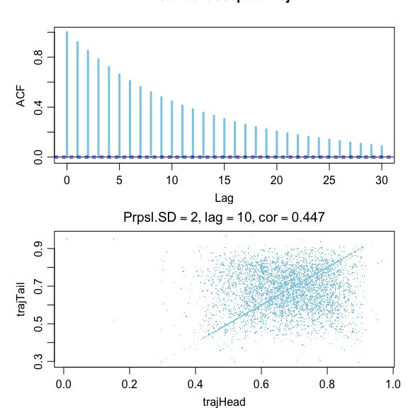
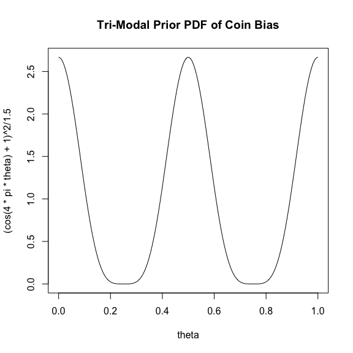
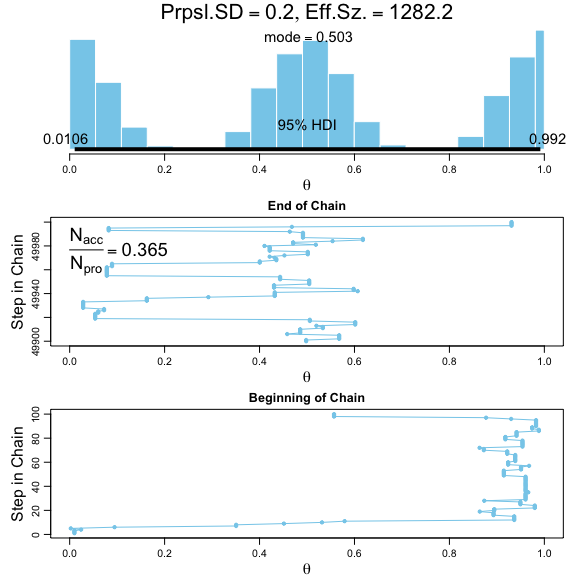
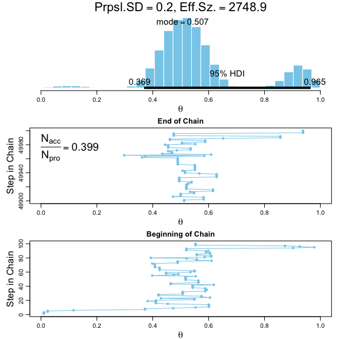

Chapter 7 Problems: Markov Chain Monte Carlo
================
Brandon Hoeft
April 8, 2018

-   [Exercise 7.1 Experiment with Metropolis Algorithm](#exercise-7.1-experiment-with-metropolis-algorithm)
    -   [Metropolis Algorithm (MCMC) with Proposal SD of 0.02](#metropolis-algorithm-mcmc-with-proposal-sd-of-0.02)
    -   [Metropolis Algorithm (MCMC) with Proposal SD of 0.2](#metropolis-algorithm-mcmc-with-proposal-sd-of-0.2)
    -   [Metropolis Algorithm (MCMC) with Proposal SD of 2.0](#metropolis-algorithm-mcmc-with-proposal-sd-of-2.0)
-   [Exercise 7.2 Explore the AutoCorrelation function](#exercise-7.2-explore-the-autocorrelation-function)
    -   [7.2A: explain code for the autocorrelation function](#a-explain-code-for-the-autocorrelation-function)
    -   [7.2B: Show the autocorrelation plots from the same prior simulations](#b-show-the-autocorrelation-plots-from-the-same-prior-simulations)
    -   [7.2C: Why is the scatterplot a dense diagonal when SD = 2.0?](#c-why-is-the-scatterplot-a-dense-diagonal-when-sd-2.0)
-   [Exercise 7.3: Using a Multimodal Prior with Metropolis Algorithm MCMC](#exercise-7.3-using-a-multimodal-prior-with-metropolis-algorithm-mcmc)
    -   [7.3A](#a)
    -   [7.3B](#b)
    -   [7.3C Metropolis Algorithm samples of a Multimodal Prior](#c-metropolis-algorithm-samples-of-a-multimodal-prior)
    -   [7.3D Metropolis Algorithm from posterior distribution with Multimodal Prior](#d-metropolis-algorithm-from-posterior-distribution-with-multimodal-prior)

Exercise 7.1 Experiment with Metropolis Algorithm
-------------------------------------------------

The script called `BernMetrop.R` from the program files for the book implements a Metrolopis Algorithm. Run the algorithm three times, each using different standard deviation of the **proposal distribution**.

The **proposal distribution** enables Metropolis algorithm to take a random walk through the parameter space of *θ*, effectively drawing samples from its posterior distribution. The SD of the **proposal distribution** we draw random samples from impacts how slowly or quickly the algorithm may explore the posterior distribution of *θ*. The prior used is Beta(*θ* | 1, 1) and the likelihood is based of 14 heads, 6 tails observations.

Here we'll explore the impact of 3 different values of proposal distribution SD, which are based off a standardized (mean = 0) normal distribution: 0.02, 0.2, 2.0. A normal distribution is used because it will lead to random proposal steps generally close to the current position.

### Metropolis Algorithm (MCMC) with Proposal SD of 0.02

First is using a proposal distribution SD of 0.02. The histogram below shows the posterior distribution followed by plots of the MCMC chain of the sampled posterior. The chain moves very slowly because the typical proposed move (+/- 1 SD or 68% of the time) is within only 0.02 *θ*. This yields a chain of small moves and a very small Effective Sample Size (ESS) due to high autocorrelation between successive moves. The percentage of proposed moves accepted is also high, because the proposed move ratio of **min**(1, P(*θ*proposed) / P(*θ*current) is generally going to yield a value close to 1, and therefore most monte carlo draws from \[0,1\] will be accepted. **This example is not an ideal simulation based on low ESS**

``` r
# added line 5 in script below. commented out line 1, 4, 57. comment out line 89 for openGraph so can generate the graph output in this RMarkdown script. Change seed in line 55 to 123. 
source("/Users/bhoeft/Desktop/temp/DBDA Programs/BernMetrop_7_1_sd1.R")
```


    *********************************************************************
    Kruschke, J. K. (2015). Doing Bayesian Data Analysis, Second Edition:
    A Tutorial with R, JAGS, and Stan. Academic Press / Elsevier.
    *********************************************************************


### Metropolis Algorithm (MCMC) with Proposal SD of 0.2

Below is the same Metropolis Algorithm MCMC simulation but using a larger proposal distribution SD of 0.2 to draw monte carlo samples from for making proposed steps. Different from the previous simulation, we see larger jumps to different values of *θ* between successive steps. This enables the algorithm to explore different values of the posterior distribution more efficiently. The chain visits many relatively representative values of *θ* in fewer steps. We see no clumpiness in the chain. This chain also has a very high ESS because successive steps are less prone to being autocorrelated as new proposal values aren't always so closely linked to each other. **This example is representative of a good MCMC simulation for this toy 1 parameter example based on a good ESS.**

``` r
# added line 5 in script below. commented out line 1, 4, 57. comment out line 89 for openGraph so can generate the graph output in this RMarkdown script. Change seed in line 55 to 123. 
source("/Users/bhoeft/Desktop/temp/DBDA Programs/BernMetrop_7_1_sd2.R")
```


    *********************************************************************
    Kruschke, J. K. (2015). Doing Bayesian Data Analysis, Second Edition:
    A Tutorial with R, JAGS, and Stan. Academic Press / Elsevier.
    *********************************************************************


### Metropolis Algorithm (MCMC) with Proposal SD of 2.0

Below is the same Metropolis Algorithm MCMC simulation but using a very large proposal distribution SD of 2.0 to draw monte carlo samples from for making proposed steps. It looks like most of the time there are no jumps in successive steps, but where a proposed move is accepted, extreme jumps across values of *θ* occur. We see proposals could easily move outside the bounds of our posterior *θ*, which is \[0,1\] bound. Hence why the chain of samples may linger in a single place for many successive steps (see the low rate of accepted proposed moves). This yields clumpy chain with little movement and therefore a good amount of autocorrelation that still yields us an ESS that's still too small (&lt; 10,000 heuristic) but better than using the 1st proposed SD of 0.02. **This example is not an ideal simulation based on low ESS**

``` r
# added line 5 in script below. commented out line 1, 4, 57. comment out line 89 for openGraph so can generate the graph output in this RMarkdown script. Change seed in line 55 to 123. 
source("/Users/bhoeft/Desktop/temp/DBDA Programs/BernMetrop_7_1_sd3.R")
```


    *********************************************************************
    Kruschke, J. K. (2015). Doing Bayesian Data Analysis, Second Edition:
    A Tutorial with R, JAGS, and Stan. Academic Press / Elsevier.
    *********************************************************************


Each of the 3 simulations shows similar behavior in the Metropolis Algorithm implementation for different values for the proposal distribution's standard deviation as documented in Figure 7.4 in the book. The 3 simulations converge on the same accurate representation of the posterior distribution (see 3 very similar histograms above with very **similar 95% highest density intervals** representing credible samples of posterior *θ* values). The 3 simulations differ though in their efficiency in exploring the parameter space to get to their solution.

Exercise 7.2 Explore the AutoCorrelation function
-------------------------------------------------

I updated the scripts run above with the following code to plot the autocorrelation function (ACF).

### 7.2A: explain code for the autocorrelation function

``` r
layout(matrix(1:2, nrow = 2))
# plot the autocorrelation function for chain values vs. chain values lag 0 to lag 30 steps behind.
acf(acceptedTraj, lag.max = 30, col = "skyblue", lwd = 3)
# the total number of simulations. 
Len <- length(acceptedTraj)
# lag value of 10.
Lag <- 10
# vector of the 1:49990 samples from the posterior.
trajHead <- acceptedTraj[1: (Len - Lag)]
# vector of the 11:50000 samples from the posterior
trajTail <- acceptedTraj[(1 + Lag): Len]
# scatterplot of the sampled values vs their lag value at k = 10 steps later 
plot(trajHead, trajTail, pch = ".", col = "skyblue",
     main = bquote(list("Prpsl.SD" == .(proposalSD),
                        lag == .(Lag),
                        cor == .(round(cor(trajHead, trajTail), 3)))))
```

### 7.2B: Show the autocorrelation plots from the same prior simulations

When the proposal SD = 0.02, we see each step does not move very far from its prior position. As such, the autocorrelation should be high. The added ACF plot shows that at lag values of 0 to 10, the correlation is at least 0.8 or higher. Using a specific lag value such as lag = 10, we see the scatterplot from the 50,000 MCMC simulations also confirms this &gt; 0.80 correlation between a simulated sample from the posterior distribution and another sample draw from 10 steps later.

``` r
# added line 5 in script below. commented out line 1, 4, 57. comment out line 89 for openGraph so can generate the graph output in this RMarkdown script. Change seed in line 55 to 123. 
# added lines 126 -142 for autocorrelation analysis
source("/Users/bhoeft/Desktop/temp/DBDA Programs/BernMetrop_7_2_sd1.R")
```


    *********************************************************************
    Kruschke, J. K. (2015). Doing Bayesian Data Analysis, Second Edition:
    A Tutorial with R, JAGS, and Stan. Academic Press / Elsevier.
    *********************************************************************



When the proposal SD = 0.2, we see each step moves a good distance from its prior simulated MCMC sample. As such, the autocorrelation should be less than before. The added ACF plot shows much lower correlation values between values at different lag values. When using a specific lag value such as lag = 10, we see the scatterplot from the 50,000 MCMC simulations also confirms no visual linear correlation between a sample value and the value 10 steps later in the simulation.

``` r
# added line 5 in script below. commented out line 1, 4, 57. comment out line 89 for openGraph so can generate the graph output in this RMarkdown script. Change seed in line 55 to 123. 
# added lines 126 -142 for autocorrelation analysis
source("/Users/bhoeft/Desktop/temp/DBDA Programs/BernMetrop_7_2_sd2.R")
```


    *********************************************************************
    Kruschke, J. K. (2015). Doing Bayesian Data Analysis, Second Edition:
    A Tutorial with R, JAGS, and Stan. Academic Press / Elsevier.
    *********************************************************************



When the proposal SD = 2.0, we see each step tends to stay in place (chunky chain because proposed moves are often rejected). But when a move is accepted it's usually a large distance from the current location in the chain. The autocorrelation should be fairly for smaller lag values as a result due to the lack of accepted proposed steps.

``` r
# added line 5 in script below. commented out line 1, 4, 57. comment out line 89 for openGraph so can generate the graph output in this RMarkdown script. Change seed in line 55 to 123. 
# added lines 126 -142 for autocorrelation analysis
source("/Users/bhoeft/Desktop/temp/DBDA Programs/BernMetrop_7_2_sd3.R")
```


    *********************************************************************
    Kruschke, J. K. (2015). Doing Bayesian Data Analysis, Second Edition:
    A Tutorial with R, JAGS, and Stan. Academic Press / Elsevier.
    *********************************************************************



### 7.2C: Why is the scatterplot a dense diagonal when SD = 2.0?

The scatterplot has a dense line resembling a diagonal when SD = 2.0 (see direct plot above) because monte carlo simulated samples from the proposal distribution (mean = 0, SD = 2.0) as it relates to a target distribution bound by \[0,1\] will lead to many proposed moves outside of \[0,1\] target distribution range that get rejected per the Metropolis algorithm (the proposed SD is probably too large). Rejected proposed moves means that a lot of steps in the MCMC trajectory of *θ* do not change between simulations, even after 10 proposals in a row. These observations of no change at lag = 10 result in a diagnoal line representing identical values.

Exercise 7.3: Using a Multimodal Prior with Metropolis Algorithm MCMC
---------------------------------------------------------------------

We'll use a multimodal prior with the Metropolis algorithm and obser how chains can transition across modes or get stuck within them. This is a good example of using MCMC to apply Bayesian inference to unusual prior beliefs.

### 7.3A

Consider a prior distribution on coin bias that puts most credibility at 0.0, 0.5, and 1.0. We will formulate this as

P(*θ*) = (cos(4*π**θ*) + 1)**<sup>2</sup> / 1.5

### 7.3B

Plot this prior distribution.

``` r
# possible values of the parameter
theta <- seq(0, 1, length = 501)
plot(theta, (cos(4 * pi * theta) + 1)**2 / 1.5, type = "l", main = "Tri-Modal Prior PDF of Coin Bias")
```



### 7.3C Metropolis Algorithm samples of a Multimodal Prior

Inside the script `BernMetrop.R` find the function definition that specifies the prior distribution. Inside that function definition, comment out the line that assigns a beta density to pTheta, and instead put in a trimodal prior like this:

``` r
#pTheta = dbeta(theta, 1, 1)
pTheta <- ((cos(4 * pi * theta) + 1)**2 / 1.5)
```

Also, feed an empty vector for the data, so the Metropolis Algorithm just exploreshe prior distribution. The histogram of the trajectory of the prior as simulated below looks very to the density plot created in section 7.3B mathematically (ignore the 95% HDI, which assumes a unimodal distribution). What we can conclude from this is that the Metropolis Algorithm is capable of sampling representatively from multimodal distributions.

``` r
source("/Users/bhoeft/Desktop/temp/DBDA Programs/BernMetrop_7_3C.R")
```


    *********************************************************************
    Kruschke, J. K. (2015). Doing Bayesian Data Analysis, Second Edition:
    A Tutorial with R, JAGS, and Stan. Academic Press / Elsevier.
    *********************************************************************



### 7.3D Metropolis Algorithm from posterior distribution with Multimodal Prior

Repeat 7.3C but with observed data under consideration (2 heads and 1 tails observed). Having observed 3 observations of coin flips with expected value of 2/3, the simulated draws from the posterior distribution do appear to make sense as its a compromise between the data and a prior belief of a trimodal distribution. The prior peak near 0 is relatively unlikely given the data and the likelihood function observed, p(D | *θ*).

``` r
source("/Users/bhoeft/Desktop/temp/DBDA Programs/BernMetrop_7_3D.R")
```


    *********************************************************************
    Kruschke, J. K. (2015). Doing Bayesian Data Analysis, Second Edition:
    A Tutorial with R, JAGS, and Stan. Academic Press / Elsevier.
    *********************************************************************


